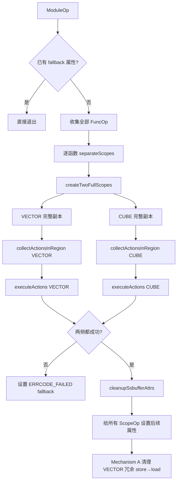
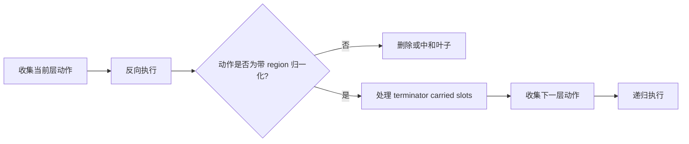
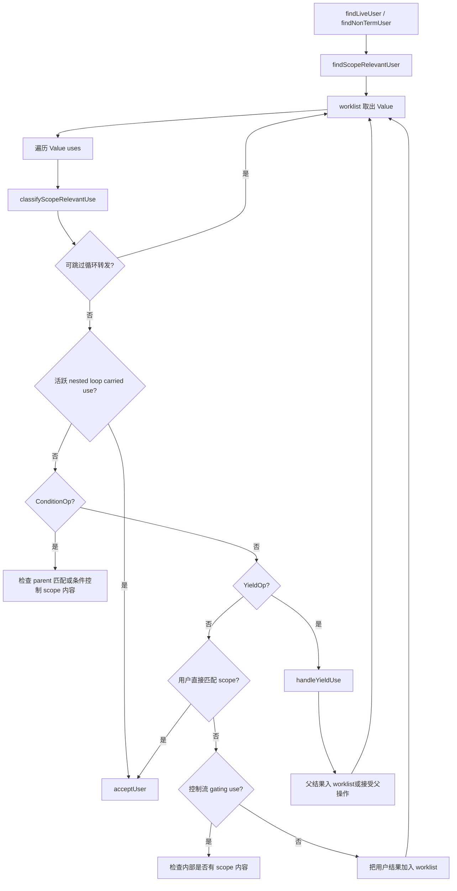
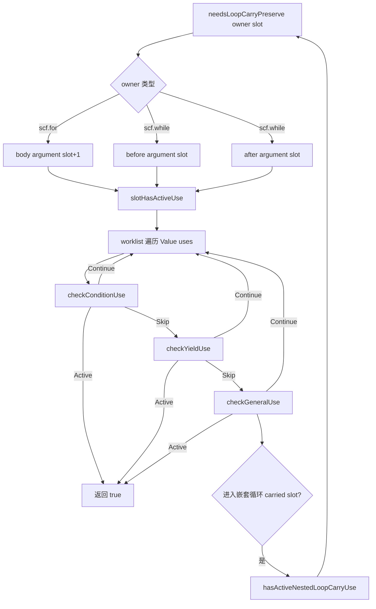
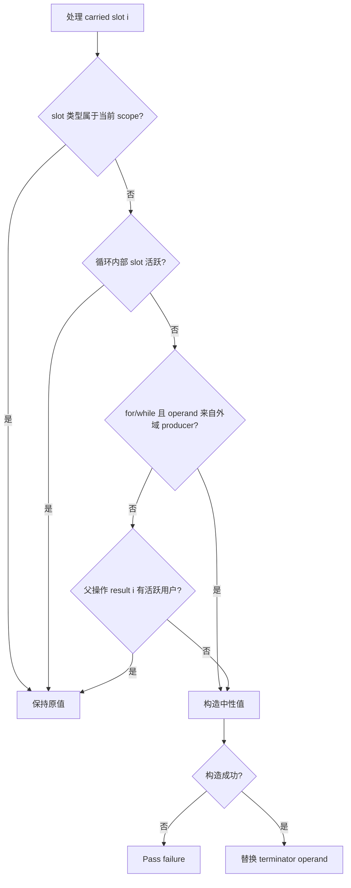
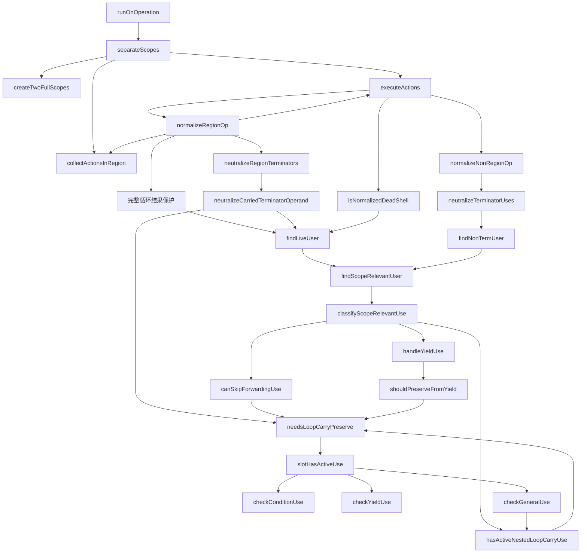

# SeparateCVScope.cpp 整体架构与复杂控制流设计分析

> 分析对象：[`third_party/ascend/lib/DynamicCVPipeline/SplitDataflow/SeparateCVScope.cpp`](third_party/ascend/lib/DynamicCVPipeline/SplitDataflow/SeparateCVScope.cpp)
>
> 本文不按源码行号重复解释，而是从设计目标、阶段划分、调用链、控制流活性和安全边界几个角度梳理整体框架。

## 1. 设计目标

`SeparateCVScopePass` 的输入是带有 `ssbuffer.core_type` 分析结果的 MLIR。一个操作可能：

- 完全属于 VECTOR；
- 完全属于 CUBE；
- 有多个结果，部分属于 VECTOR、部分属于 CUBE；
- 本身是控制流容器，内部同时包含两种 scope 的操作。

Pass 的目标不是把原 IR 就地切成两段，而是：

1. 先复制出两份完整、结构合法的 IR；
2. 在 VECTOR 副本中裁掉 CUBE 内容；
3. 在 CUBE 副本中裁掉 VECTOR 内容；
4. 保持 `scf.for`、`scf.while`、`scf.if`、`scf.parallel` 的 region、block argument、result 和 terminator 位置关系合法；
5. 对不再有语义用途、但结构上必须存在的 operand 使用中性值占位。

核心难点不是复制，而是判断混合控制流中的某个值究竟只是“结构性回传”，还是仍会影响当前 scope 的真实计算。

---

## 2. 顶层处理流水线



### 2.1 为什么采用“完整复制后裁剪”

优点：

- 两个 scope 初始结构完全一致，控制流 region 和 SSA 映射天然合法；
- VECTOR/CUBE 共用同一套裁剪算法，只替换 `scopeType`；
- 不需要在原 IR 上同时移动属于不同 scope 的嵌套操作。

代价：

- 裁剪前短暂存在两份完整 IR；
- 必须准确识别跨 scope 的 SSA 依赖；
- 混合结果控制流无法直接 erase，需要专门归一化。

---

## 3. 四个设计层次

整份实现可以划为四层。

### 3.1 属性语义层

负责把字符串属性转换为统一判断：

- `CoreTypeInfo`；
- `parseCoreTypeInfo()`；
- `getScopeMatchInfo()`；
- `matchesScope()`。

这一层提供两个关键布尔量：

- 至少一个结果属于当前 scope；
- 所有结果都属于当前 scope。

后续动作分类只依赖这两个量，不再直接解析字符串。

### 3.2 计划层

负责只读扫描 IR 并生成动作：

- `isPureForScope()`；
- `collectActionForOp()`；
- `collectActionsInRegion()`；
- `PendingActionKind`。

动作只有两类：

- 直接删除；
- 归一化控制流或混合结果操作。

这是一种 collect-then-mutate 设计，避免边遍历边删除。

### 3.3 分析层

负责判断 SSA 值是否活跃：

- 外部/跨操作活性：`findScopeRelevantUser()` 系列；
- 循环槽内部活性：`needsLoopCarryPreserve()` 系列；
- region 内容判断：`regionHasScopeContent()`。

这里是复杂度最高的部分。

### 3.4 修改层

负责真正改变 IR：

- `buildNeutralValue()`；
- `neutralizeCarriedTerminatorOperand()`；
- `neutralizeRegionTerminators()`；
- `neutralizeTerminatorUses()`；
- `normalizeRegionOp()`；
- `normalizeNonRegionOp()`；
- `executeActions()`。

修改层调用分析层作安全判断，但分析层原则上不修改 IR。

---

## 4. 动作收集与执行框架

### 4.1 分类矩阵

| 操作状态 | 典型含义 | 动作 |
|---|---|---|
| 不匹配当前 scope，且可直接处理 | 纯外域叶子操作 | `EraseDirectly` |
| 至少一个结果匹配，但并非全部匹配 | 混合结果操作 | `NormalizeControlFlow` |
| 控制流子树不是纯当前 scope | 内部含混合内容 | `NormalizeControlFlow` |
| 所有结果和嵌套内容都匹配 | 纯当前 scope 子树 | 无动作 |

### 4.2 为什么反向执行动作

`executeActions()` 从 action 数组尾部向前执行。典型 SSA 顺序是 producer 在前、consumer 在后。反向处理更容易先中和或删除 consumer，再删除 producer，从而减少 `erase()` 时仍有 use 的情况。

但代码仍通过 `hasLiveUsers()` 做最终结构检查，因此“反向”只是降低冲突，不是唯一安全保障。

### 4.3 递归边界

`collectActionsInRegion()` 遇到带 region 的操作时不会立即递归收集全部后代，而是先给这个容器记录归一化动作。执行到 `normalizeRegionOp()` 后，再对其 region 收集下一层动作。

因此递归模式是：



这种逐层下降让每一层先解决控制流边界，再改内部内容。

---

## 5. 第一套 SSA 遍历：寻找当前 scope 的相关用户

### 5.1 要回答的问题

给定一个 Value，例如循环结果 `%r`：

> `%r` 是否直接或经过若干转发操作，最终被当前 scope 的操作、控制流条件或活跃循环槽使用？

入口有两个：

- `findLiveUser(value, scopeType)`：terminator 也可作为证据；
- `findNonTermUser(value, scopeType)`：过滤 terminator，寻找真正的非结构消费者。

二者都进入 `findScopeRelevantUser()`。

### 5.2 主调用链



### 5.3 “跳过”与“接受”的区别

- `canSkipForwardingUse()`：证明这条边只喂给无用的外域循环槽，因此不沿它继续传播。
- `hasActiveNestedLoopCarryUse()`：证明这条边进入的循环槽在循环内部有当前 scope 使用，因此立即接受。

两者都需要把 use 映射到 loop result slot，并可能调用 `needsLoopCarryPreserve()`。当前实现会在同一个 `classifyScopeRelevantUse()` 中先做 skip 判断，再做 active 判断，存在同一 use 重复计算 loop slot 活性的可能。

### 5.4 特殊控制流边

普通 SSA 是 operation result → operation operand，但 SCF 还存在逻辑映射：

- `scf.yield` operand → parent operation result；
- `scf.condition` operand 0 → while 是否继续；
- for/parallel bounds 和 if condition → 控制流内部内容是否可执行；
- loop init operand → region block argument → yield/condition → loop result。

第一套分析显式编码这些关系，不能只依赖普通 def-use 链。

---

## 6. 第二套 SSA 遍历：判断循环 carried slot 是否必须保留

### 6.1 要回答的问题

给定循环 `owner` 和结果槽 `slotIndex`：

> 与该槽对应的 region block argument，在循环内部是否最终影响当前 scope 的有效计算？

入口是 `needsLoopCarryPreserve(owner, slotIndex, scopeType)`。

### 6.2 for 和 while 的槽映射

#### `scf.for`

```text
operands: [lower, upper, step, init_0, init_1, ...]
body args: [induction_var, iter_arg_0, iter_arg_1, ...]
results:  [result_0, result_1, ...]
```

所以：

- init operand 的结果槽 = operand index - 3；
- result slot `i` 对应 body argument `i + 1`。

#### `scf.while`

```text
operands:     [init_0, init_1, ...]
before args:  [before_arg_0, before_arg_1, ...]
condition:    [cond, carried_0, carried_1, ...]
after args:   [after_arg_0, after_arg_1, ...]
yield:        [next_0, next_1, ...]
results:      [result_0, result_1, ...]
```

同一个 slot 可能在 before 或 after region 中活跃，因此两侧 block argument 都要检查。

### 6.3 主调用链



### 6.4 互递归关系

嵌套循环让调用链形成互递归：

```text
needsLoopCarryPreserve
  -> slotHasActiveUse
     -> checkGeneralUse
        -> hasActiveNestedLoopCarryUse
           -> needsLoopCarryPreserve
```

每一次 `slotHasActiveUse()` 有自己的 `seenValues`，可防止本次 Value 图遍历重复访问；但它不是跨递归层、跨调用的全局 memo。因此复杂嵌套循环可能重复分析同一个 `(owner, slotIndex, scopeType)`。

### 6.5 三态检查协议

`UseCheckResult` 将三个检查器串成责任链：

- `Skip`：本检查器不识别该 use；
- `Continue`：已识别并处理，但未发现活跃消费；
- `Active`：发现必须保留的证据。

这比单纯 bool 更适合区分“不是我的类型”和“是我的类型但不活跃”。

---

## 7. 两套分析如何协作

两套分析不是简单重复，它们观察不同方向：

| 分析 | 起点 | 主要方向 | 回答的问题 |
|---|---|---|---|
| `findScopeRelevantUser()` | 任意 operation result/value | 向外沿 uses 和 parent results | 最终有没有当前 scope 消费者？ |
| `slotHasActiveUse()` | 循环 region block argument | 向循环内部及嵌套循环传播 | 某个 carried slot 在循环体内是否活跃？ |

协作点是 `hasActiveNestedLoopCarryUse()`：第一套遍历遇到 loop init 时，会进入第二套；第二套遍历遇到嵌套 loop init 时，也会递归进入第二套。

---

## 8. `needsLoopCarryPreserve()` 的四类调用位置

当前文件中，它参与四种不同语义决策。

### 8.1 `canSkipForwardingUse()` 的 for 分支

外域 for result slot 如果循环体内不活跃，允许忽略 init forwarding edge。

### 8.2 `canSkipForwardingUse()` 的 while 分支

外域 while slot 如果内部不活跃，且 while 结果也没有直接当前 scope 用户，允许忽略 forwarding edge。

### 8.3 `hasActiveNestedLoopCarryUse()`

当某个 Value 喂给循环 init operand 时，用它判断该 use 是否应成为活跃证据。

### 8.4 `shouldPreserveFromYield()` 和中和阶段

- `shouldPreserveFromYield()` 判断 yield 到父结果的路径是否应保留 owner；
- `neutralizeCarriedTerminatorOperand()` 在真正改 IR 前再次确认 slot 不活跃。

严格按函数调用点计数，源码中直接调用超过四处；按设计职责则可归纳为“转发剪枝、嵌套循环接受、yield 传播、修改前安全检查”四类。

---

## 9. carried operand 中和的三层防线

中和意味着把 `scf.yield` 或 `scf.condition` 的某个 operand 换成零值/临时 alloc。为避免改变有效语义，代码采用多层保护。

### 9.1 第一层：完整循环提前保留

在 `normalizeRegionOp()` 中：

- 操作是 `scf.for` 或 `scf.while`；
- 循环内部没有当前 scope 内容；
- 但循环结果仍被当前 scope 使用；

则直接保留完整循环，不再中和任何 carried operand。

这是 loop 级、粗粒度保护。

### 9.2 第二层：slot 内部活性保护

`neutralizeCarriedTerminatorOperand()` 对每个外域 slot 调用 `needsLoopCarryPreserve()`。只要对应 block argument 在循环内部活跃，就保留原 operand。

这是 slot 级、循环内部保护。

### 9.3 第三层：父结果外部用户保护

同一函数还对 parent operation 的同 slot result 调用 `findLiveUser()`。若结果沿外部 SSA 链仍到达当前 scope，则保留。

这是 slot 级、循环外部保护。

### 9.4 foreign producer 例外

如果旧 carried operand 由完全属于另一 scope 的 producer 产生，for/while 会跳过父结果用户保护。原因是不能仅因为父循环结果有用户，就让外域 producer 在当前 scope 副本中被反向保活。

### 9.5 决策流程



---

## 10. `scf.for` 的完整逻辑链

考虑一个带多个 iter args/results 的 `scf.for`。

### 10.1 收集阶段

1. `collectActionsInRegion()` 遇到 for。
2. `isPureForScope()` 递归检查其结果和 body。
3. 只要有外域结果或外域嵌套操作，就记录 `NormalizeControlFlow`。

### 10.2 执行阶段

1. `executeActions()` 调用 `normalizeRegionOp()`。
2. 若 for body 没有当前 scope 内容，但 for result 仍被当前 scope 使用，则完整保留并返回。
3. 否则进入 `neutralizeRegionTerminators()`。
4. 每个 `scf.yield` operand 位置直接映射到 for result slot。
5. 对外域 slot：
   - 检查 body `iter_arg = slot + 1` 是否活跃；
   - 检查 for result 是否仍有活跃用户；
   - 安全时替换 yield operand。
6. 对 body 继续收集和执行嵌套动作。
7. 若最终 body 无当前 scope 内容且结果无当前 scope 活跃用户，将 for 视作 dead shell；没有结构用户时 erase。

### 10.3 活性传播中的 for

- use 落在 operand 0～2：它是控制流 gating 值；只要 body 有当前 scope 内容就活跃。
- use 落在 operand 3 以后：它是 init operand；通过减 3 映射到 result slot。
- body block argument 0 是 induction variable；carried slot 必须从 argument 1 开始。

---

## 11. `scf.while` 的完整逻辑链

`scf.while` 比 for 复杂，因为它有 before/after 两个 region 和两种 terminator。

### 11.1 收集阶段

与 for 相同：只要 while 不是当前 scope 的纯子树，就记录归一化动作。

### 11.2 before region

before block 的 terminator 是 `scf.condition`：

- operand 0 是布尔条件，决定是否继续循环；
- operand `i + 1` 是送往 after region 和 while result 体系的 carried value。

`neutralizeRegionTerminators()` 因此对 condition 使用 offset 1。

### 11.3 after region

通常以 `scf.yield` 结束：

- operand `i` 是下一轮 slot `i`；
- offset 为 0。

### 11.4 slot 活性

`needsLoopCarryPreserve()` 同时从：

- before block argument `i`；
- after block argument `i`；

启动 `slotHasActiveUse()`。任一侧存在当前 scope 消费就保留。

### 11.5 condition 的特殊处理

- condition operand 0 如果控制着内部包含当前 scope 内容的 while，则活跃；
- 对应当前 owner 和 slot 的 condition carried operand只是标准传递，不因“被 condition 使用”本身就判活跃；
- 非标准映射采取较保守策略，防止错误中和。

### 11.6 while 转发剪枝

`canSkipForwardingUse()` 对 while 的要求比 for 更严格：

1. slot 必须是外域；
2. slot 内部不能活跃；
3. while 的直接用户中不能有当前 scope 操作。

满足三项才将这条 use 当作纯转发忽略。

---

## 12. `scf.if` 和 `scf.parallel` 的处理边界

### 12.1 `scf.if`

- 被视为控制流操作，可进入归一化流程；
- operand 0 是 gating condition；
- 如果 then/else 内有当前 scope 内容，条件值必须保持活跃；
- region terminator 通常是 `scf.yield`，混合结果可按槽中和。

### 12.2 `scf.parallel`

- 被视为控制流操作；
- 前 `3 * numLoops` 个 operand 是各维度 lower/upper/step，属于 gating inputs；
- 当前 `needsLoopCarryPreserve()` 只专门实现 for/while，因此 parallel 的 carried/reduction 语义主要依靠一般结果用户和保守控制流判断，而没有和 for/while 同等精细的 slot 分析。

这是当前实现能力边界之一。

---

## 13. 死壳删除与结构安全

归一化后，一个控制流操作可能只剩：

- region 和 terminator 的结构；
- 没有当前 scope 内容；
- 结果也没有当前 scope 活跃用户。

`isNormalizedDeadShell()` 用语义条件判定“死壳”，随后 `hasLiveUsers()` 再判断 MLIR 结构上能否 erase。

两者不能合并：

- `findLiveUser()` 是 scope 语义分析，可能忽略外域或纯转发用户；
- `hasLiveUsers()` 是原始 SSA 完整性检查，只要有 use 就不能直接 erase。

因此有时日志会显示“语义上是 dead shell，但仍有 structural users”，此时保守保留。

---

## 14. 当前代码中的重复分析

### 14.1 同一分类函数内的重复

`classifyScopeRelevantUse()` 先调用：

1. `canSkipForwardingUse()`；
2. `hasActiveNestedLoopCarryUse()`。

对 loop init use，这两个函数都会做：

- 判断 owner 是否为 loop；
- 获取 init operand 区间；
- 计算 result slot；
- 调用 `needsLoopCarryPreserve()`。

如果第一次没有证明可跳过，第二次可能立即重新计算相同 slot。

### 14.2 跨阶段重复

同一个 slot 可能依次在以下位置分析：

- 外部活性搜索的 forwarding skip；
- nested loop active 判断；
- yield 传播判断；
- `normalizeRegionOp()` 完整循环结果保护；
- `neutralizeCarriedTerminatorOperand()` 修改前 slot 检查；
- 同一函数中的 parent result 用户检查。

这些判断并非完全等价，但底层 worklist 遍历大量重叠。

### 14.3 两个相似 worklist 引擎

`findScopeRelevantUser()` 和 `slotHasActiveUse()` 都具有：

- `SmallVector<Value>` worklist；
- `SmallPtrSet` visited；
- 遍历 `Value::getUses()`；
- 对 terminator、控制流和普通操作分别分类；
- 将中间操作结果加入 worklist。

它们的起点和判定上下文不同，所以不能直接粗暴合并，但可以共享通用遍历骨架或统一边分类模型。

### 14.4 为什么不能简单缓存所有结果

中和阶段会调用 `operand.set(replacement)`，嵌套动作还会 erase 操作。IR 在执行过程中发生变化，因此此前得到的活性结论可能失效。

安全的缓存策略必须限定生命周期，例如：

- 仅在单次只读 action 收集阶段缓存；
- 每次 IR 修改后清空缓存或增加 IR generation；
- 只缓存不受 terminator 替换影响的局部映射，如 loop init operand 到 slot 的解析结果。

---

## 15. 可行的重构方向

### 15.1 统一 loop use 解析

引入一个只做结构映射的辅助结果：

```text
LoopCarryUseInfo {
  owner,
  slotIndex,
  resultTypeMatches,
  preserveRequired
}
```

`classifyScopeRelevantUse()` 对每个 use 只解析一次，再决定 Skip、Accept 或 Propagate，可消除同层重复调用。

### 15.2 将 skip/active 合并为三态或四态判决

例如：

- `IgnoreForwarding`；
- `ActiveConsumer`；
- `PropagateResults`；
- `NoDecision`。

这比先问“能否跳过”、再问“是否活跃”更直接。

### 15.3 建立单次归一化的 slot verdict 表

在处理一个 for/while 前，集中计算每个 slot：

| 字段 | 含义 |
|---|---|
| `matchesScope` | slot 属性是否属于当前 scope |
| `activeInsideLoop` | block argument 是否影响 scope 内容 |
| `activeOutsideLoop` | parent result 是否有 scope 用户 |
| `foreignProducer` | terminator operand 是否来自纯外域 producer |
| `neutralizable` | 综合结论 |

随后完整循环保护、terminator 中和和 dead-shell 判断复用该表。

### 15.4 区分只读分析阶段与修改阶段

可以把每个 region 的处理明确拆成：

1. snapshot/analysis；
2. decision；
3. mutation；
4. cache invalidation；
5. nested recursion。

这样更容易证明哪些结论在修改后仍然有效。

### 15.5 保留最终修改前复查

即使引入缓存，也建议在真正执行 `operand.set()` 或 `op->erase()` 前保留轻量结构检查。因为这是防止错误 IR 的最后安全线。

---

## 16. 设计优点与风险

### 16.1 优点

- VECTOR/CUBE 共用同一算法，整体对称。
- collect-then-mutate 避免迭代器失效。
- 对 for/while 的 slot 位置映射比较明确。
- 外部用户与循环内部用户分开分析，问题定义清晰。
- 真正修改前有多层保守检查。
- 无法构造中性值时显式失败并触发 fallback，而不是生成非法 IR。

### 16.2 风险

- 复杂嵌套循环可能重复递归分析，编译时间随 def-use 图增长。
- 两套传播器的规则未来可能演化不一致。
- `buildNeutralValue()` 对动态 shaped type 等类型无法构造替代值。
- `CoreTypeInfo::getResultType()` 的“越界回退到第一项”依赖属性约定，可能掩盖结果数量不匹配。
- `scf.parallel` 没有与 for/while 同等的 carried slot 专项分析。
- 完整循环提前返回是粗粒度保守策略：保证语义，但可能在目标 scope 保留更多外域计算。

---

## 17. 阅读复杂控制流时的推荐顺序

针对一个具体 for/while 问题，建议按以下顺序定位：

1. 查看操作的 `ssbuffer.core_type` 及每个 result slot 的归属。
2. 查看 `collectActionsInRegion()` 最终把它分类为何种动作。
3. 检查 `normalizeRegionOp()` 是否触发“完整循环提前保留”。
4. 对目标 slot 手工建立 init operand、block argument、terminator operand、parent result 的位置映射。
5. 沿 `needsLoopCarryPreserve()` 检查循环内部活性。
6. 沿 `findLiveUser()` 检查循环外部活性。
7. 检查旧 terminator operand 是否由 foreign scope producer 产生。
8. 最后检查 `isNormalizedDeadShell()` 和 `hasLiveUsers()` 是否允许删除外壳。

---

## 18. 总体调用链速查



一句话概括：该 Pass 先复制结构，再以 scope 为参数制定裁剪计划；面对普通操作按结果归属删除，面对复杂控制流则通过“外部结果活性 + 循环内部 slot 活性 + region 内容”三类分析，安全地中和 carried values，最后删除无内容且无用户的控制流外壳。

---

## 19. Mechanism A：VECTOR 侧冗余 store→load 消除（Pass 末尾优化）

### 19.1 问题来源

`createTwoFullScopes()` 用 `IRMapping` 克隆完整函数。CUBE 侧有一段"从共享 buffer 读回标量"的 scalar load；克隆后它也被复制进 VECTOR scope。在 VECTOR scope 里，这个 load 读的是本 scope 自己刚 store 进去的值，属于纯冗余。

这个 load：

- 有用户，不是死代码，DCE 不会删除；
- 语义上是纯冗余（读回刚写入的值）。

### 19.2 识别依据

配对靠 `ssbuffer.transfer_id`：同一传输的生产 store 与消费 load 共享同一个 transfer_id 属性（约定来自 `SSBufferManager`）。只有依赖该配对信息才能识别这种冗余。

### 19.3 实现要点

1. 只对 `hivm::TCoreTypeAttr == VECTOR` 的 scope 生效；
2. Pass 1 walk 收集每个 transfer_id → 被存储的值；
3. Pass 2 walk 找到同 transfer_id 的 load：删除其上的 volatile 注解（`annotation::MarkOp` + `kMemrefExtVolatile`），用 store 值替换所有 use，再统一 erase；
4. 跳过 `storeVal == loadOp.getResult()` 的自环；
5. 在 `runOnOperation()` 末尾、设置 `kHIVMMatmulLimitedInCubeAttr` 之后统一调用。

### 19.4 为什么 DCE 解决不了

DCE 看的是"无用户即死代码"。这里的 load 有用户，因此必须靠 transfer_id 配对信息做专用消除，属于克隆副作用的清理，而不是上游分析的错误。

### 19.5 设计价值

- 清理型优化，不改变合法 IR 语义；
- 消除的是克隆副作用产生的冗余；
- 删除的 volatile 注解只对 CUBE 侧有意义，在 VECTOR 侧移除是安全的。

### 19.6 在流程中的位置

Mechanism A 在 `runOnOperation()` 的所有函数裁剪完成后执行，输入是已设置好 `hivm::TCoreTypeAttr` 的 scope，输出是消除冗余 scalar 读回的 scope。它不参与裁剪主流程，是流水线输出前的最后一道清理。
